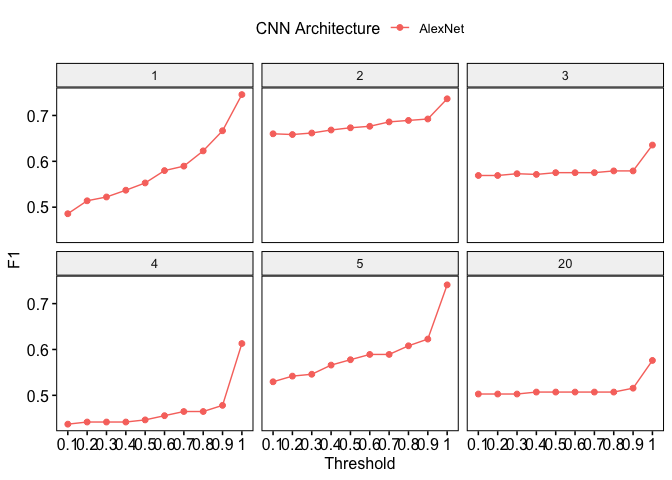
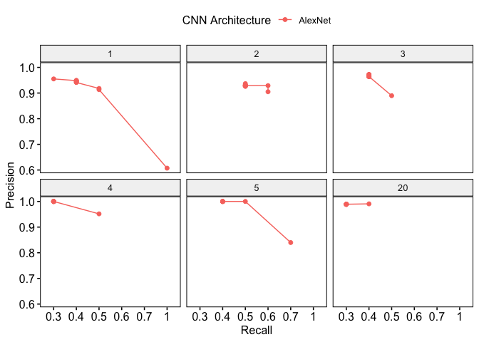

gibbonNetR: an R package for the use of CNNs on acoustic data
================
Dena J. Clink
2023-08-19

## Overview

This readme provides instructions and code for training and testing a
deep learning model on spectrogram images.

``` r
devtools::load_all("/Users/denaclink/Desktop/RStudioProjects/gibbonNetR")
```

## Location of Spectrogram Images

### Training Data Path:

``` r
input.data.path <-  c('/Users/denaclink/Desktop/RStudioProjects/Multi-species-detector/data/imagesmalaysiaHQ/')
```

### Testing Data Path:

``` r
test.data.path <- c('/Users/denaclink/Desktop/RStudioProjects/Multi-species-detector/data/imagesmalaysiamaliau/')
```

## Parameters for Training

### Training Data Folder Short Name:

``` r
trainingfolder.short <- 'imagesmalaysiaHQ'
```

### Unfreezing Layers:

``` r
unfreeze.param <- TRUE  # FALSE means the features are frozen; TRUE unfrozen
```

### Number of Epoch Iterations:

``` r
epoch.iterations <- c(1,2,3,4,5,20)
```

### Location to Save the Output:

``` r
output.data.path <-paste('data/','output','unfrozen',unfreeze.param,trainingfolder.short,'/', sep='_')
dir.create(output.data.path)
```

    ## Warning in dir.create(output.data.path):
    ## 'data/_output_unfrozen_TRUE_imagesmalaysiaHQ_' already exists

### Early Stopping:

``` r
early.stop <- 'yes'  # NOTE: Must comment out if you don't want early stopping
```

## Training the Model using gibbonNetR and evaluating on a test set

``` r
gibbonNetR::train_alexnet(input.data.path=input.data.path,
                          test.data.path=test.data.path,
                          unfreeze = TRUE,
                          epoch.iterations=epoch.iterations,
                          early.stop = "yes",
                          output.base.path = "data/",
                          trainingfolder.short=trainingfolder.short)
```

## Extracting Performance Data

``` r
performancetables.dir <- 'data/_output_unfrozen_TRUE_imagesmalaysiaHQ_/performance_tables/'
PerformanceOutput <- gibbonNetR::get_best_performance(performancetables.dir=performancetables.dir)
```

    ## [1] "Best F1 results"
    ## # A tibble: 1 × 9
    ##   Precision Recall    F1 `Validation loss` `Training Data`  `N epochs`
    ##       <dbl>  <dbl> <dbl>             <dbl> <chr>                 <dbl>
    ## 1     0.607  0.966 0.746           0.00218 imagesmalaysiaHQ          1
    ## # ℹ 3 more variables: `CNN Architecture` <chr>, Threshold <dbl>, Frozen <lgl>
    ## [1] "Best Precision results"
    ## # A tibble: 1 × 9
    ##   Precision Recall    F1 `Validation loss` `Training Data`  `N epochs`
    ##       <dbl>  <dbl> <dbl>             <dbl> <chr>                 <dbl>
    ## 1         1  0.280 0.437                 0 imagesmalaysiaHQ          4
    ## # ℹ 3 more variables: `CNN Architecture` <chr>, Threshold <dbl>, Frozen <lgl>
    ## [1] "Best Recall results"
    ## # A tibble: 1 × 9
    ##   Precision Recall    F1 `Validation loss` `Training Data`  `N epochs`
    ##       <dbl>  <dbl> <dbl>             <dbl> <chr>                 <dbl>
    ## 1     0.607  0.966 0.746           0.00218 imagesmalaysiaHQ          1
    ## # ℹ 3 more variables: `CNN Architecture` <chr>, Threshold <dbl>, Frozen <lgl>

### Displaying Performance Plots

``` r
PerformanceOutput$f1_plot
```

<!-- -->

``` r
PerformanceOutput$pr_plot
```

<!-- -->

## Repeat the Training (if required)
