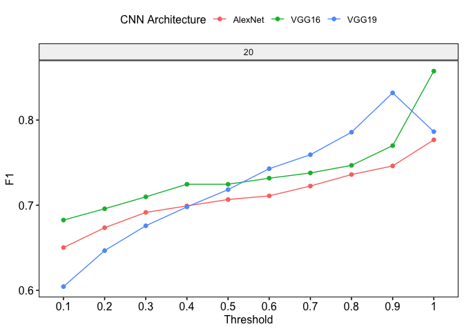

gibbonNetR: R Package for the Use of CNNs and Transfer Learning on
Acoustic Data
================
Dena J. Clink
2023-08-19

## Overview

This readme provides instructions and code for training and testing a
deep learning model on spectrogram images.

## Installation

You can install the `gibbonNetR` package from its repository using
`devtools`:

``` r
# If you don't have devtools installed
install.packages("devtools")

# Install gibbonNetR
devtools::install_github("https://github.com/DenaJGibbon/gibbonNetR")
```

``` r
devtools::load_all("/Users/denaclink/Desktop/RStudioProjects/gibbonNetR")
```

## Create spectrogram images

Load the package and then utilize the `spectrogram_images` function:

``` r
library(gibbonNetR)

# Parameters

- `trainingBasePath`: The base directory containing the training folders with audio files.
  
- `outputBasePath`: Directory where the processed spectrogram images will be saved.
  
- `splits`: A numeric vector specifying the split ratios for train, valid, and test sets. The default split is `c(0.8, 0.1, 0.1)` but can be modified by the user.


gibbonNetR::spectrogram_images(
  trainingBasePath ='/Volumes/DJC Files/Clink et al Zenodo Data/TrainingFilesValidated/',
  outputBasePath ='data/imagesmalaysia/',
  splits = c(0.6, 0.2, 0.2)
)
```

The function will process the audio files from the `trainingBasePath`,
create spectrogram images and then save these images into the respective
train, valid, and test folders inside the `outputBasePath`.

<figure>

<figcaption aria-hidden="true">Figure 1a. Example Spectrogram
image</figcaption>
</figure>

<figure>

<figcaption aria-hidden="true">Figure 1b. Example Spectrogram
image</figcaption>
</figure>

## Parameters for Training

Training Data Path:

``` r
input.data.path <-  c('/Users/denaclink/Desktop/RStudioProjects/Multi-species-detector/data/imagesmalaysiaHQ/')
```

Testing Data Path:

``` r
test.data.path <- c('/Users/denaclink/Desktop/RStudioProjects/Multi-species-detector/data/imagesmalaysiamaliau/')
```

Training Data Folder Short Name:

``` r
trainingfolder.short <- 'imagesmalaysiaHQ'
```

Unfreezing Layers:

``` r
unfreeze.param <- TRUE  # FALSE means the features are frozen; TRUE unfrozen
```

Number of Epoch Iterations:

``` r
epoch.iterations <- c(1,2,3,4,5,20)
```

Location to Save the Output:

``` r
output.data.path <-paste('data/','output','unfrozen',unfreeze.param,trainingfolder.short,'/', sep='_')
dir.create(output.data.path)
```

    ## Warning in dir.create(output.data.path):
    ## 'data/_output_unfrozen_TRUE_imagesmalaysiaHQ_' already exists

Early Stopping:

``` r
early.stop <- 'yes'  # NOTE: Currently only early stopping available
```

## Training the models using gibbonNetR and evaluating on a test set

``` r
gibbonNetR::train_alexnet(input.data.path=input.data.path,
                          test.data=test.data.path,
                          unfreeze = TRUE,
                          epoch.iterations=epoch.iterations,
                          early.stop = "yes",
                          output.base.path = "data/",
                          trainingfolder=trainingfolder.short)
```

<figure>

<figcaption aria-hidden="true">Figure 2. Sample Loss Plot</figcaption>
</figure>

## Extracting Performance Data

``` r
performancetables.dir <- '/Users/denaclink/Desktop/RStudioProjects/gibbonNetR/data/_output_unfrozen_TRUE_imagesmalaysia_/performance_tables/'
PerformanceOutput <- gibbonNetR::get_best_performance(performancetables.dir=performancetables.dir)
```

    ## [1] "Best F1 results"
    ## # A tibble: 1 × 9
    ##   Precision Recall    F1 `Validation loss` `Training Data` `N epochs`
    ##       <dbl>  <dbl> <dbl>             <dbl> <chr>                <dbl>
    ## 1     0.753  0.995 0.857             0.145 imagesmalaysia          20
    ## # ℹ 3 more variables: `CNN Architecture` <chr>, Threshold <dbl>, Frozen <lgl>
    ## [1] "Best Precision results"
    ## # A tibble: 1 × 9
    ##   Precision Recall    F1 `Validation loss` `Training Data` `N epochs`
    ##       <dbl>  <dbl> <dbl>             <dbl> <chr>                <dbl>
    ## 1         1  0.433 0.604            0.0897 imagesmalaysia          20
    ## # ℹ 3 more variables: `CNN Architecture` <chr>, Threshold <dbl>, Frozen <lgl>
    ## [1] "Best Recall results"
    ## # A tibble: 1 × 9
    ##   Precision Recall    F1 `Validation loss` `Training Data` `N epochs`
    ##       <dbl>  <dbl> <dbl>             <dbl> <chr>                <dbl>
    ## 1     0.635      1 0.777            0.0790 imagesmalaysia          20
    ## # ℹ 3 more variables: `CNN Architecture` <chr>, Threshold <dbl>, Frozen <lgl>

Displaying Performance Plots

``` r
PerformanceOutput$f1_plot
```

<!-- -->

``` r
PerformanceOutput$pr_plot
```

<!-- -->
