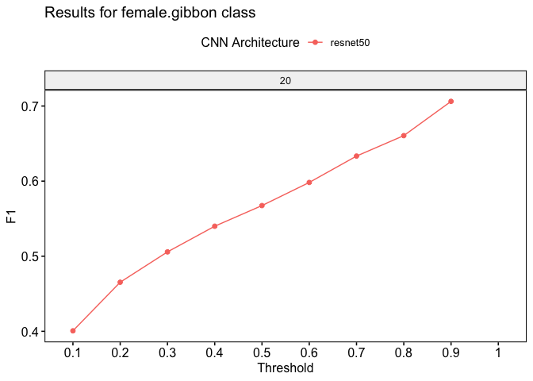
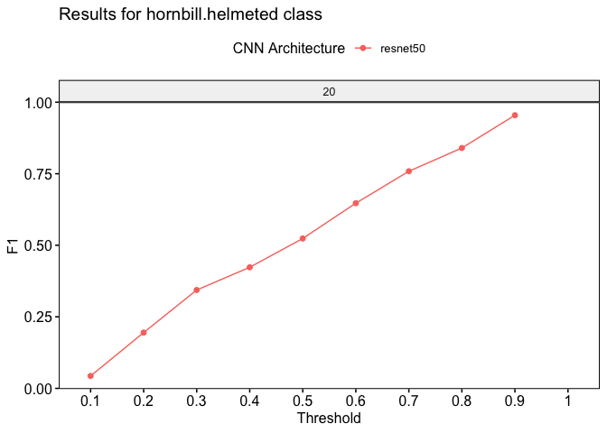

gibbonNetR: R Package for the Use of CNNs and Transfer Learning on
Acoustic Data
================
Dena J. Clink and Abdul Hamid Ahmad
2024-04-04

## Overview

This readme provides instructions and code for training and testing the
performance of different convolutional neural network model
architectures on spectrogram images.

## Installation

You can install the `gibbonNetR` package from its repository using
`devtools`:

``` r
# If you don't have devtools installed
install.packages("devtools")

# Install gibbonNetR
devtools::install_github("https://github.com/DenaJGibbon/gibbonNetR")
```

## Download example training files on Zenodo and convert to spectrogram images

``` r
library(gibbonNetR)

# Link to training clips on Zenodo
ZenodoLink <- 'https://zenodo.org/records/10927637/files/TrainingClipsMulti.zip?download=1'

# Download into specified zip file location
download.file(url = ZenodoLink, destfile = 'data/data.zip')

# Unzip folder
exdir <- 'data/trainingclips/'
utils::unzip(zipfile = 'data/data.zip', exdir = exdir )

# Check folder composition
TrainingDatapath <- paste(exdir,"TrainingClipsMulti",sep='')

# Check folder names
list.files(TrainingDatapath)

# Create spectrogram images
gibbonNetR::spectrogram_images(
  trainingBasePath = TrainingDatapath,
  outputBasePath   = 'data/examples/',
  splits           = c(0.7, 0.3, 0),  # 70% training, 30% validation
  minfreq.khz = 0.4,
  maxfreq.khz = 2,
  new.sampleratehz= 'NA'
)
```

## Download example test files from Zenodo and convert to spectrogram images

``` r
# Link to test clips on Zenodo
ZenodoLink <- 'https://zenodo.org/records/10927637/files/TestFilesMulti.zip?download=1'

# Download into specified zip file location
download.file(url = ZenodoLink, destfile = 'data/data.zip')

# Unzip folder
exdir <- 'data/testclips/'
utils::unzip(zipfile = 'data/data.zip', exdir = exdir )

# Check folder composition
TestDatapath <- paste(exdir,"TestFilesMulti",sep='')

# Check folder names
list.files(TestDatapath)

# Create spectrogram images
gibbonNetR::spectrogram_images(
  trainingBasePath = TestDatapath,
  outputBasePath   = 'data/examples/',
  splits           = c(0, 0, 1),  # 100% in test folder
  minfreq.khz = 0.4,
  maxfreq.khz = 2,
  new.sampleratehz= 'NA'
)
```

## Here are a few spectrogram images

<div class="figure">


<p class="caption">
Figure 1. Spectrograms of training clips for CNNs
</p>

</div>

## Training the models using gibbonNetR and evaluating on a test set

``` r
# Location of spectrogram images for training
input.data.path <-  'data/examples/'

# Location of spectrogram images for testing
test.data.path <- 'data/examples/test/'

# User specified training data label for metadata
trainingfolder.short <- 'danummulticlassexample'

# We can specify the number of epochs to train here
epoch.iterations <- c(20)

# Function to train a multi-class CNN
gibbonNetR::train_CNN_multi(input.data.path=input.data.path,
                            architecture ='resnet50',
                            learning_rate = 0.001,
                            class_weights = c(0.3, 0.3, 0.2, 0.2, 0),
                            test.data=test.data.path,
                            unfreeze.param = TRUE,
                            epoch.iterations=epoch.iterations,
                            save.model= TRUE,
                            early.stop = "yes",
                            output.base.path = "model_output/",
                            trainingfolder=trainingfolder.short,
                            noise.category = "noise")
```

## Extracting Performance Data

``` r
# Evaluate model performance
performancetables.dir <- "model_output/_danummulticlassexample_multi_unfrozen_TRUE_/performance_tables_multi"

PerformanceOutput <- gibbonNetR::get_best_performance(performancetables.dir=performancetables.dir,
                                                      class='female.gibbon',
                                                      model.type = "multi",Thresh.val=0)
```

    ## [1] "Evaluating performance for female.gibbon Here are the present classes: female.gibbon"    
    ## [2] "Evaluating performance for female.gibbon Here are the present classes: hornbill.helmeted"
    ## [3] "Evaluating performance for female.gibbon Here are the present classes: hornbill.rhino"   
    ## [4] "Evaluating performance for female.gibbon Here are the present classes: long.argus"       
    ## [1] "Best F1 results"
    ## [1] "female.gibbon"
    ##   Sensitivity Specificity Pos Pred Value Neg Pred Value Precision    Recall
    ## 1   0.9980276   0.8135819      0.5464363      0.9994547 0.5464363 0.9980276
    ##          F1 Prevalence Detection Rate Detection Prevalence Balanced Accuracy
    ## 1 0.7062107  0.1836957      0.1833333            0.3355072         0.9058048
    ##   Validation loss          Training Data N epochs CNN Architecture         AUC
    ## 1    0.0003838354 danummulticlassexample       20         resnet50 0.005914096
    ##   Threshold Frozen         Class
    ## 1       0.9   TRUE female.gibbon
    ## [1] "Best Precision results"
    ##   Sensitivity Specificity Pos Pred Value Neg Pred Value Precision    Recall
    ## 1   0.9980276   0.8135819      0.5464363      0.9994547 0.5464363 0.9980276
    ##          F1 Prevalence Detection Rate Detection Prevalence Balanced Accuracy
    ## 1 0.7062107  0.1836957      0.1833333            0.3355072         0.9058048
    ##   Validation loss          Training Data N epochs CNN Architecture         AUC
    ## 1    0.0003838354 danummulticlassexample       20         resnet50 0.005914096
    ##   Threshold Frozen         Class
    ## 1       0.9   TRUE female.gibbon
    ## [1] "Best Recall results"
    ##   Sensitivity Specificity Pos Pred Value Neg Pred Value Precision Recall
    ## 1           1   0.7394585      0.4634369              1 0.4634369      1
    ##          F1 Prevalence Detection Rate Detection Prevalence Balanced Accuracy
    ## 1 0.6333542  0.1836957      0.1836957            0.3963768         0.8697292
    ##   Validation loss          Training Data N epochs CNN Architecture         AUC
    ## 1    0.0003838354 danummulticlassexample       20         resnet50 0.005914096
    ##   Threshold Frozen         Class
    ## 1       0.7   TRUE female.gibbon
    ## [1] "Best AUC results"
    ##   Sensitivity Specificity Pos Pred Value Neg Pred Value Precision Recall
    ## 1           1   0.3266755      0.2504941              1 0.2504941      1
    ##          F1 Prevalence Detection Rate Detection Prevalence Balanced Accuracy
    ## 1 0.4006322  0.1836957      0.1836957            0.7333333         0.6633378
    ##   Validation loss          Training Data N epochs CNN Architecture         AUC
    ## 1    0.0003838354 danummulticlassexample       20         resnet50 0.005914096
    ##   Threshold Frozen         Class
    ## 1       0.1   TRUE female.gibbon

``` r
PerformanceOutput$f1_plot
```

<!-- -->

``` r
PerformanceOutput$best_f1$F1
```

    ## [1] 0.7062107

``` r
# Evaluate model performance
performancetables.dir <- "model_output/_danummulticlassexample_multi_unfrozen_TRUE_/performance_tables_multi"

PerformanceOutput <- gibbonNetR::get_best_performance(performancetables.dir=performancetables.dir,
                                                      class='hornbill.helmeted',
                                                      model.type = "multi",Thresh.val=0)
```

    ## [1] "Evaluating performance for hornbill.helmeted Here are the present classes: female.gibbon"    
    ## [2] "Evaluating performance for hornbill.helmeted Here are the present classes: hornbill.helmeted"
    ## [3] "Evaluating performance for hornbill.helmeted Here are the present classes: hornbill.rhino"   
    ## [4] "Evaluating performance for hornbill.helmeted Here are the present classes: long.argus"       
    ## [1] "Best F1 results"
    ## [1] "hornbill.helmeted"
    ##   Sensitivity Specificity Pos Pred Value Neg Pred Value Precision    Recall
    ## 1   0.9130435           1              1      0.9992698         1 0.9130435
    ##          F1  Prevalence Detection Rate Detection Prevalence Balanced Accuracy
    ## 1 0.9545455 0.008333333    0.007608696          0.007608696         0.9565217
    ##   Validation loss          Training Data N epochs CNN Architecture         AUC
    ## 1    0.0003838354 danummulticlassexample       20         resnet50 0.002700513
    ##   Threshold Frozen             Class
    ## 1       0.9   TRUE hornbill.helmeted
    ## [1] "Best Precision results"
    ##   Sensitivity Specificity Pos Pred Value Neg Pred Value Precision    Recall
    ## 1   0.9130435           1              1      0.9992698         1 0.9130435
    ##          F1  Prevalence Detection Rate Detection Prevalence Balanced Accuracy
    ## 1 0.9545455 0.008333333    0.007608696          0.007608696         0.9565217
    ##   Validation loss          Training Data N epochs CNN Architecture         AUC
    ## 1    0.0003838354 danummulticlassexample       20         resnet50 0.002700513
    ##   Threshold Frozen             Class
    ## 1       0.9   TRUE hornbill.helmeted
    ## [1] "Best Recall results"
    ##   Sensitivity Specificity Pos Pred Value Neg Pred Value Precision Recall
    ## 1           1   0.9305809      0.1079812              1 0.1079812      1
    ##          F1  Prevalence Detection Rate Detection Prevalence Balanced Accuracy
    ## 1 0.1949153 0.008333333    0.008333333           0.07717391         0.9652905
    ##   Validation loss          Training Data N epochs CNN Architecture         AUC
    ## 1    0.0003838354 danummulticlassexample       20         resnet50 0.002700513
    ##   Threshold Frozen             Class
    ## 1       0.2   TRUE hornbill.helmeted
    ## [1] "Best AUC results"
    ##   Sensitivity Specificity Pos Pred Value Neg Pred Value  Precision Recall
    ## 1           1   0.6287906     0.02213667              1 0.02213667      1
    ##          F1  Prevalence Detection Rate Detection Prevalence Balanced Accuracy
    ## 1 0.0433145 0.008333333    0.008333333            0.3764493         0.8143953
    ##   Validation loss          Training Data N epochs CNN Architecture         AUC
    ## 1    0.0003838354 danummulticlassexample       20         resnet50 0.002700513
    ##   Threshold Frozen             Class
    ## 1       0.1   TRUE hornbill.helmeted

``` r
PerformanceOutput$f1_plot
```

<!-- -->

``` r
PerformanceOutput$best_f1$F1
```

    ## [1] 0.9545455

## Extract embeddings

``` r
ModelPath <- "model_output/_danummulticlassexample_multi_unfrozen_TRUE_/_danummulticlassexample_20_resnet50_model.pt"
result <- extract_embeddings(test_input="data/examples/test/",
                                      model_path=ModelPath,
                                     target_class = "female.gibbon")
```

    ## [1] "processing embeddings"
    ## [1] "Unupervised clustering for female.gibbon"
    ##          Sensitivity          Specificity       Pos Pred Value 
    ##            0.9112426            0.9844652            0.9295775 
    ##       Neg Pred Value            Precision               Recall 
    ##            0.9801149            0.9295775            0.9112426 
    ##                   F1           Prevalence       Detection Rate 
    ##            0.9203187            0.1836957            0.1673913 
    ## Detection Prevalence    Balanced Accuracy 
    ##            0.1800725            0.9478539

``` r
result$EmbeddingsCombined
```

<!-- -->

``` r
result$NMI
```

    ## [1] 0.7360569

``` r
result$ConfusionMatrix
```

    ##          Sensitivity          Specificity       Pos Pred Value 
    ##            0.9112426            0.9844652            0.9295775 
    ##       Neg Pred Value            Precision               Recall 
    ##            0.9801149            0.9295775            0.9112426 
    ##                   F1           Prevalence       Detection Rate 
    ##            0.9203187            0.1836957            0.1673913 
    ## Detection Prevalence    Balanced Accuracy 
    ##            0.1800725            0.9478539
