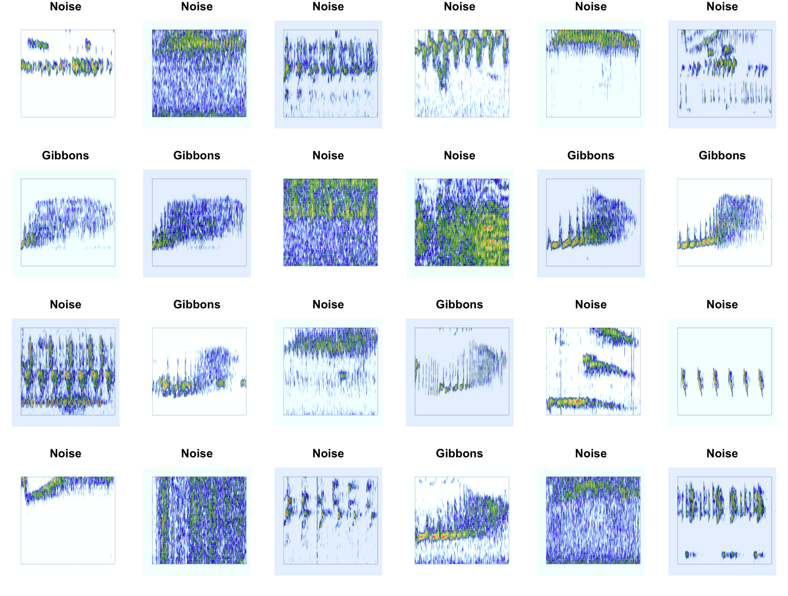
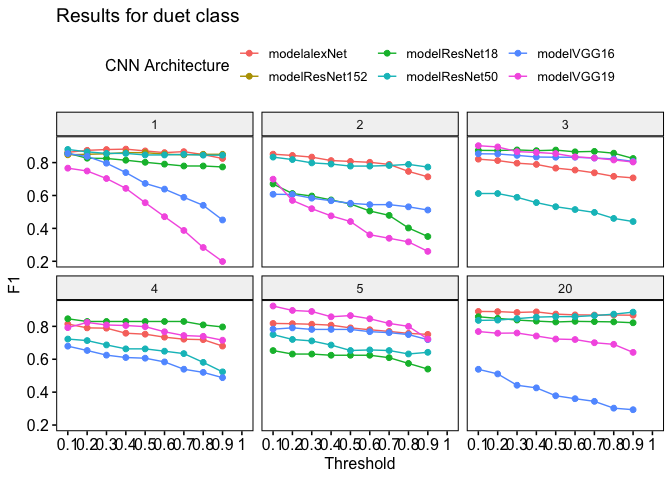
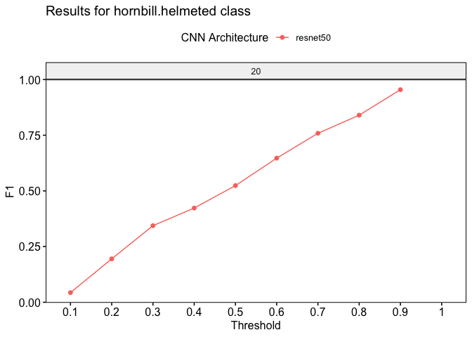
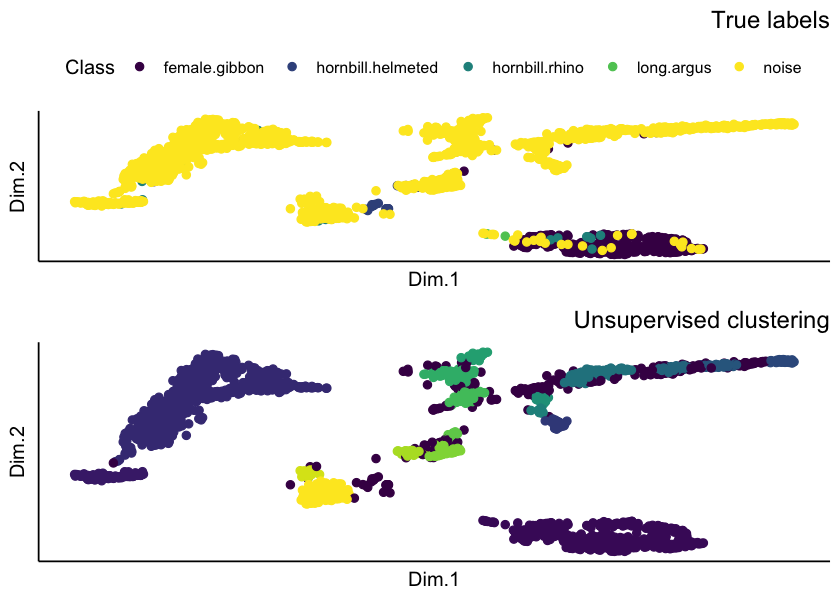

gibbonNetR: R Package for the Use of CNNs and Transfer Learning on
Acoustic Data
================
Dena J. Clink and Abdul Hamid Ahmad
2024-04-04

# Overview

This readme provides instructions and code for training and testing the
performance of different convolutional neural network model
architectures on spectrogram images.

# Installation

You can install the `gibbonNetR` package from its repository using
`devtools`:

``` r
# If you don't have devtools installed
install.packages("devtools")

# Install gibbonNetR
devtools::install_github("https://github.com/DenaJGibbon/gibbonNetR")
```

# Preparing the data

## Download example training files on Zenodo and convert to spectrogram images

``` r
library(gibbonNetR)

# Link to training clips on Zenodo
ZenodoLink <- 'https://zenodo.org/records/10927637/files/TrainingClipsMulti.zip?download=1'

# Download into specified zip file location
download.file(url = ZenodoLink, destfile = 'data/data.zip')

# Unzip folder
exdir <- 'data/trainingclips/'
utils::unzip(zipfile = 'data/data.zip', exdir = exdir )

# Check folder composition
TrainingDatapath <- paste(exdir,"TrainingClipsMulti",sep='')

# Check folder names
list.files(TrainingDatapath)

# Create spectrogram images
gibbonNetR::spectrogram_images(
  trainingBasePath = TrainingDatapath,
  outputBasePath   = 'data/examples/',
  splits           = c(0.7, 0.3, 0),  # 70% training, 30% validation
  minfreq.khz = 0.4,
  maxfreq.khz = 2,
  new.sampleratehz= 'NA'
)
```

## Download example test files from Zenodo and convert to spectrogram images

``` r
# Link to test clips on Zenodo
ZenodoLink <- 'https://zenodo.org/records/10927637/files/TestFilesMulti.zip?download=1'

# Download into specified zip file location
download.file(url = ZenodoLink, destfile = 'data/data.zip')

# Unzip folder
exdir <- 'data/testclips/'
utils::unzip(zipfile = 'data/data.zip', exdir = exdir )

# Check folder composition
TestDatapath <- paste(exdir,"TestFilesMulti",sep='')

# Check folder names
list.files(TestDatapath)

# Create spectrogram images
gibbonNetR::spectrogram_images(
  trainingBasePath = TestDatapath,
  outputBasePath   = 'data/examples/',
  splits           = c(0, 0, 1),  # 100% in test folder
  minfreq.khz = 0.4,
  maxfreq.khz = 2,
  new.sampleratehz= 'NA'
)
```

## Here are a few spectrogram images

<div class="figure">


<p class="caption">
Figure 1. Spectrograms of training clips for CNNs
</p>

</div>

# Train the models

## Training the models using gibbonNetR and evaluating on a test set

``` r
# Location of spectrogram images for training
input.data.path <-  'data/examples/'

# Location of spectrogram images for testing
test.data.path <- 'data/examples/test/'

# User specified training data label for metadata
trainingfolder.short <- 'danummulticlassexample'

# We can specify the number of epochs to train here
epoch.iterations <- c(20)

# Function to train a multi-class CNN
gibbonNetR::train_CNN_multi(input.data.path=input.data.path,
                            architecture ='resnet50',
                            learning_rate = 0.001,
                            class_weights = c(0.3, 0.3, 0.2, 0.2, 0),
                            test.data=test.data.path,
                            unfreeze.param = TRUE,
                            epoch.iterations=epoch.iterations,
                            save.model= TRUE,
                            early.stop = "yes",
                            output.base.path = "model_output/",
                            trainingfolder=trainingfolder.short,
                            noise.category = "noise")
```

# Evaluating model performance

## Specify for the ‘female.gibbon’ class

``` r
# Evaluate model performance
performancetables.dir <- "model_output/_danummulticlassexample_multi_unfrozen_TRUE_/performance_tables_multi"

PerformanceOutput <- gibbonNetR::get_best_performance(performancetables.dir=performancetables.dir,
                                                      class='female.gibbon',
                                                      model.type = "multi",Thresh.val=0)
```

## Examine the results

``` r
PerformanceOutput$f1_plot
```



``` r
PerformanceOutput$best_f1$F1
#> [1] 0.7062107
```

## Specify for the ‘hornbill.helmeted’ class

``` r

# Evaluate model performance
performancetables.dir <- "model_output/_danummulticlassexample_multi_unfrozen_TRUE_/performance_tables_multi"

PerformanceOutput <- gibbonNetR::get_best_performance(performancetables.dir=performancetables.dir,
                                                      class='hornbill.helmeted',
                                                      model.type = "multi",Thresh.val=0)
```

## Examine the results

``` r
PerformanceOutput$f1_plot
```



``` r
PerformanceOutput$best_f1$F1
#> [1] 0.9545455
```

# Use the pre-trained model to extract embeddings and use unsupervised clustering to identify signals

## Extract embeddings

``` r

ModelPath <- "model_output/_danummulticlassexample_multi_unfrozen_TRUE_/_danummulticlassexample_20_resnet50_model.pt"
result <- extract_embeddings(test_input="data/examples/test/",
                                      model_path=ModelPath,
                                     target_class = "female.gibbon")
```

## We can plot the unsupervised clustering results

``` r
result$EmbeddingsCombined
```



### We can output the NMI results, and the confusion matrix results when we use ‘hdbscan’ to match the target class to the cluster with the largest number of observations

``` r
result$NMI
#> [1] 0.7505927
result$ConfusionMatrix
#>          Sensitivity          Specificity       Pos Pred Value 
#>            0.9112426            0.9875721            0.9428571 
#>       Neg Pred Value            Precision               Recall 
#>            0.9801762            0.9428571            0.9112426 
#>                   F1           Prevalence       Detection Rate 
#>            0.9267803            0.1836957            0.1673913 
#> Detection Prevalence    Balanced Accuracy 
#>            0.1775362            0.9494074
```
