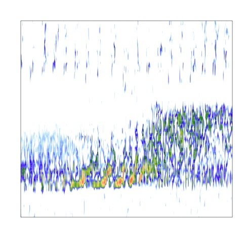

gibbonNetR: R Package for the Use of CNNs and Transfer Learning on
Acoustic Data
================
Dena J. Clink and Abdul Hamid Ahmad
2024-05-28

# Overview

This README provides instructions and code for training and testing the
performance of different convolutional neural network model
architectures on spectrogram images.

# Installation

You can install the `gibbonNetR` package from its repository using
`devtools`:

``` r
# If you don't have devtools installed
install.packages("devtools")

# Install gibbonNetR
devtools::install_github("https://github.com/DenaJGibbon/gibbonNetR")

# The first time you use the package 'torch' will need to install additional packages. You can start the process using the following:
library(torch)
```

# Quickstart guide

``` r
  library(gibbonNetR)

  # Set file path to spectorgram images  
  filepath <- system.file("extdata", "multiclass/", package = "gibbonNetR")

  # Train simple CNN model
  train_CNN_multi(
    input.data.path = filepath,
    test.data = paste(filepath,'/test/',sep=''),
    architecture = "alexnet",  # Choose 'alexnet', 'vgg16', 'vgg19', 'resnet18', 'resnet50', or 'resnet152'
    unfreeze.param = TRUE,
    batch_size = 6,
    class_weights = rep( (1/5), 5),
    learning_rate = 0.001,
    epoch.iterations = 1,  # Or any other list of integer epochs
    early.stop = "yes",
    save.model= FALSE,
    output.base.path = paste(tempdir(),'/MultiDir/',sep=''),
    trainingfolder = "test_multi",
    noise.category = 'noise'
  )
```

# Preparing the data

## Download example training files on Zenodo and convert to spectrogram images

``` r
library(gibbonNetR)

# Link to training clips on Zenodo
ZenodoLink <- 'https://zenodo.org/records/11355157/files/trainingclips.zip?download=1'

# Download into specified zip file location
download.file(url = ZenodoLink, destfile = 'data/spectrogram_image_examples.zip',method='curl')

# Unzip folder
exdir <- 'data/'
utils::unzip(zipfile = 'data/spectrogram_image_examples.zip', exdir = exdir )

# Check folder composition
TrainingDatapath <- paste(exdir,"trainingclips",sep='')

# Check folder names
list.files(TrainingDatapath)

# Create spectrogram images
spectrogram_images(
   trainingBasePath = TrainingDatapath,
   outputBasePath = 'data/trainingimages/',
   minfreq.khz = 0.4,
   maxfreq.khz = 1.6,
   splits = c(0.7, 0.3, 0), # Assign proportion to training, validation, or test folders
   new.sampleratehz = 'NA'
 )
```

## Here are a few spectrogram images

<div class="figure">


<p class="caption">
Figure 1. Spectrograms of training clips for CNNs
</p>

</div>

## Download example test files on Zenodo and convert to spectrogram images

``` r
library(gibbonNetR)

# Link to training clips on Zenodo
ZenodoLink <- 'https://zenodo.org/records/11355157/files/testclips.zip?download=1'

# Download into specified zip file location
download.file(url = ZenodoLink, destfile = 'data/spectrogram_image_examples.zip',method='curl')

# Unzip folder
exdir <- 'data/'
utils::unzip(zipfile = 'data/spectrogram_image_examples.zip', exdir = exdir )

# Check folder composition
TestDatapath <- paste(exdir,"testclips",sep='')

# Check folder names
list.files(TestDatapath)

# Create spectorgram images
spectrogram_images(
   trainingBasePath = TestDatapath,
   outputBasePath = 'data/testimages/',
   minfreq.khz = 0.4,
   maxfreq.khz = 1.6,
   splits = c(0, 0, 1), # Assign proportion to training, validation, or test folders
   new.sampleratehz = 'NA'
 )
```

# Train the models

## Training the models using gibbonNetR and evaluating on a test set

``` r
# Location of spectrogram images for training
input.data.path <-  'data/trainingimages/'

# Location of spectrogram images for testing
test.data.path <- 'data/testimages/test/'

# User specified training data label for metadata
trainingfolder.short <- 'danummulticlassexample'

# We can specify the number of epochs to train here
epoch.iterations <- c(20)

# Function to train a multi-class CNN
gibbonNetR::train_CNN_multi(input.data.path=input.data.path,
                            architecture ='resnet50',
                            learning_rate = 0.001,
                            class_weights = c(0.3, 0.3, 0.2, 0.2, 0),
                            test.data=test.data.path,
                            unfreeze.param = TRUE,
                            epoch.iterations=epoch.iterations,
                            save.model= TRUE,
                            early.stop = "yes",
                            output.base.path = "model_output/",
                            trainingfolder=trainingfolder.short,
                            noise.category = "noise")
```

# Evaluating model performance

## Specify for the ‘female.gibbon’ class

``` r
# Evaluate model performance
performancetables.dir <- "model_output/_danummulticlassexample_multi_unfrozen_TRUE_/performance_tables_multi"

PerformanceOutput <- gibbonNetR::get_best_performance(performancetables.dir=performancetables.dir,
                                                      class='female.gibbon',
                                                      model.type = "multi",Thresh.val=0)
```

## Examine the results

``` r
PerformanceOutput$f1_plot
```


``` r
PerformanceOutput$best_f1$F1
#> [1] 0.9768844
```

# Use the pre-trained model to extract embeddings and use unsupervised clustering to identify signals

## Extract embeddings

``` r

ModelPath <- "model_output/_danummulticlassexample_multi_unfrozen_TRUE_/_danummulticlassexample_20_resnet50_model.pt"
result <- extract_embeddings(test_input="data/examples/test/",
                                      model_path=ModelPath,
                                     target_class = "female.gibbon")
```

## We can plot the unsupervised clustering results

``` r
result$EmbeddingsCombined
```


### We can explore the unsupervised clustering results

Here we can see the Normalize Mutual Information score

``` r
result$NMI
#> [1] 0.7346602
```

The confusion matrix results when we use ‘hdbscan’ to match the target
class to the cluster with the largest number of observations

``` r
result$ConfusionMatrix
#>          Sensitivity          Specificity       Pos Pred Value 
#>            0.9130435            0.9835556            0.9258517 
#>       Neg Pred Value            Precision               Recall 
#>            0.9805051            0.9258517            0.9130435 
#>                   F1           Prevalence       Detection Rate 
#>            0.9194030            0.1835994            0.1676343 
#> Detection Prevalence    Balanced Accuracy 
#>            0.1810595            0.9482995
```

## We can then deploy the model over longer sound files.

``` r
  
   library(gibbonNetR)
   
    # Load data
   data("TempBinWav")

   # Save in temp directory
   dir.create(paste(tempdir(),'/MultiDir/Wav/',sep=''),recursive = T, showWarnings = FALSE)

   # Write to temp directory
   writeWave(TempBinWav,filename = paste(tempdir(),'/MultiDir/Wav/','TempBinWav.wav',sep=''))

   # Find model path
   # Set model directory
   trained_models_dir <- system.file("extdata", "trainedresnetmulti/", package = "gibbonNetR")

   # Specify model path
   ModelPath <- list.files(trained_models_dir,full.names = T)

   # Deploy trained model over sound files
   deploy_CNN_multi(
     clip_duration = 12,
     architecture='resnet18',
     output_folder = paste(tempdir(),'/MultiDir/Results/Images/',sep=''),
     output_folder_selections = paste(tempdir(),'/MultiDir/Results/Selections/',sep=''),
     output_folder_wav = paste(tempdir(),'/MultiDir/Results/Wavs/',sep=''),
     detect_pattern=NA,
     top_model_path = ModelPath,
     path_to_files = paste(tempdir(),'/MultiDir/Wav/',sep=''),
     downsample_rate = 'NA',
     save_wav = F,
     class_names = c('female.gibbon','hornbill.helmeted','hornbill.rhino','long.argus','noise'),
     noise_category = 'noise',
     single_class = FALSE,
     single_class_category = 'female.gibbon',
     threshold = .25,
     max_freq_khz = 2
   )
   
```

<figure>

<figcaption aria-hidden="true">“A spectrogram image of a
detection”</figcaption>
</figure>
