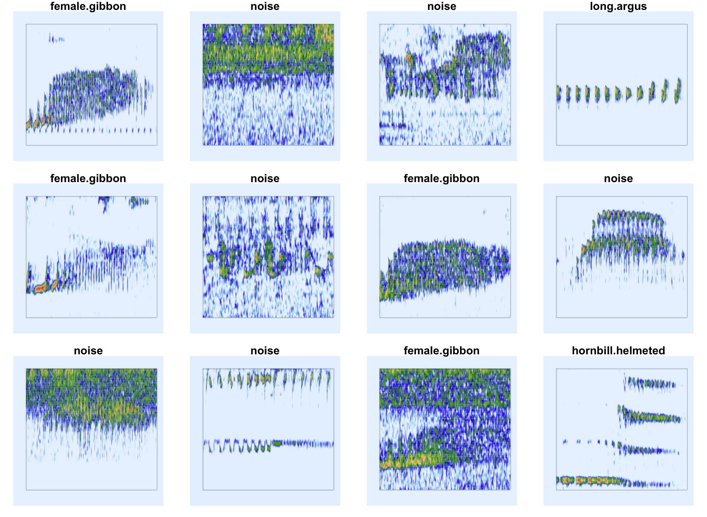
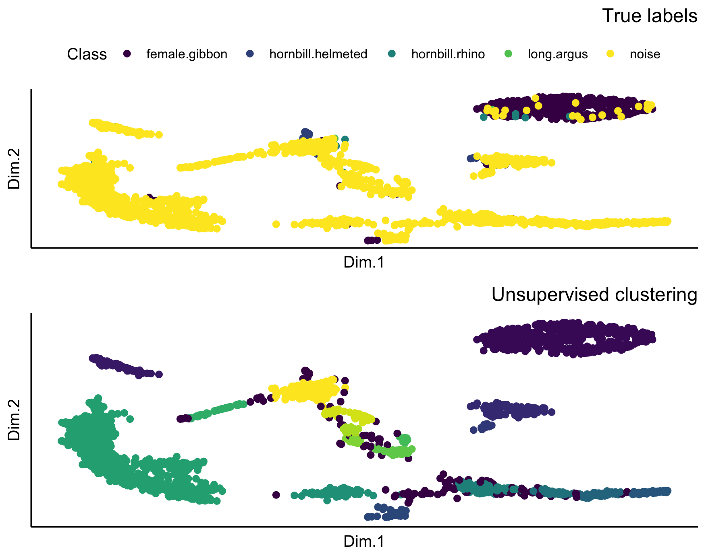

# Summary

Automated detection of acoustic signals is crucial for effectively monitoring vocal animals and their habitats across large spatial and temporal scales. Recent advances in deep learning have made high-performance automated detection approaches accessible to more practitioners. However, there are few deep learning approaches that can be implemented natively in R. The 'torch for R' ecosystem has made the use of convolutional neural networks (CNNs) accessible for R users. Here, we provide an R package and workflow to use CNNs for automated detection and classification of acoustics signals from passive acoustic monitoring data. We provide examples using data collected in Sabah, Malaysia. The package provides functions to create spectrogram images from labeled data, compare the performance of different CNN architectures, deploy trained models over directories of sound files, and extract embeddings from trained models. The R programming language remains one of the most commonly used languages among ecologists, and we hope that this package makes deep learning approaches more accessible to this audience. In addition, these models can serve as important benchmarks for future automated detection work.

# Statement of need

## *Passive acoustic monitoring*

We are in a biodiversity crisis, and there is a great need for the ability to rapidly assess biodiversity in order to understand and mitigate anthropogenic impacts. One approach that can be especially effective for monitoring of sound-producing yet cryptic animals is the use of passive acoustic monitoring [@gibb2018], a technique that relies on autonomous acoustic recording units. PAM allows researchers to monitor acoustically active animals and their habitats at temporal and spatial scales that are impossible to achieve using only human observers. Interest in use of PAM in terrestrial environments has increased substantially in recent years [@sugai2019], due to the reduced price of autonomous recording units and improved battery life and data storage capabilities. However, the use of PAM often leads to the collection of terabytes of data that is time- and cost-prohibitive to analyze manually.

## *Automated detection*

Automated detection for PAM data refers to identifying the start and stop time of signals of interest within a longer sound recording [@stowell2022]. Some of the early non-deep learning approaches for the automated detection of acoustic signals in terrestrial PAM data include binary point matching [@katz2016], spectrogram cross-correlation [@balantic2020], or the use of a band-limited energy detector and subsequent classifier, such as support vector machine [@clink2023; @kalan2015]. Recent advances in deep learning have revolutionized image and speech recognition [@lecun2015 ], with important cross-over for the analysis of PAM data. Traditional approaches to machine learning relied heavily on feature engineering, since early machine learning algorithms required a reduced set of representative features that were manually chosen by researchers, such as features estimated from the spectrogram.

Deep learning does not require feature engineering [@stevens2020], as the algorithms include a step that identifies relevant features from the input. This can lead to faster development time and increased ability to represent complex patterns typically seen in image and acoustic data. Convolutional neural networks (CNNs) --- one of the most widely used deep learning algorithms---are useful for processing data that have a 'grid-like topology', such as image data that can be considered a 2-dimensional grid of pixels [@goodfellow2016]. The 'convolutional' layer learns the feature representations of the inputs; these convolutional layers consist of a set of filters, which are two-dimensional matrices of numbers, and the primary parameter is the number of filters [@gu2018]. If training data are scarce, overfitting may occur as representations of images tend to be large with many variables [@lecun1995].

## *Transfer learning*

Training deep learning models generally requires a large amount of training data and substantial computing resources. Transfer learning is an approach wherein the architecture of a pre-trained CNN (which is generally trained on a very large dataset) is applied to a new classification problem. For example, CNNs trained on the ImageNet dataset of \> 1 million images [@deng2009] such as ResNet have been applied to automated detection/classification of primate and bird species from PAM data [@dufourq2022; @ruan2022]. Generally, very few practitioners train a CNN from scratch, and there are two common approaches for transfer learning. The first option is to use the CNN as a feature extractor, and train only the last classification layer. The second option is known as 'fine-tuning', where instead of initializing a neural network with random weights, the initialization is done using the pre-trained network. Using these pre-trained weights is valuable because the model has already learned useful feature representations [@pytorch_quantized_transfer_learning]. Both approaches require substantially less computing power than training from scratch. The functions in the 'gibbonNetR' package allow users to train models using both types of transfer learning.

## State of the field

The two most popular open-source programming languages are R and Python [@scavetta2021]. Python has surpassed R in terms of overall popularity, but R remains an important language for the life sciences [@lawlor2022]. 'Keras' [@chollet2015], 'PyTorch' [@paszke2019] and 'Tensorflow' [@martínabadi2015] are some of the more popular neural network libraries; these libraries were all initially developed for the Python programming language. One of the earliest implementations of automated detection using R was the 'monitoR' package, which included functions for template detection [@katz2016]. The 'warbleR' package included functions for energy-based detection, which identifies signals of interest in a certain frequency range above specified energy thresholds [@araya2017warbler]. The 'gibbonR' package combined energy-based detection with traditional machine learning classification [@clink2019gibbonfindr].

Until recently, deep learning implementations in R relied on the 'reticulate' package, which served as an interface to Python [@ushey2022]. For example, early packages for automated detection using deep learning in R used the 'reticulate' package [@ruff2021 @silva2022soundclass]. However, the recent release of the 'torch for R' ecosystem provides a framework based on 'PyTorch' that runs natively in R and has no dependency on Python [@falbel2023]. Running natively in R means more straightforward installation, and higher accessibility for users of the R programming environment. @keydana2023 provides tutorials for image and audio classification in the 'torch for R' ecosystem, and the functionality in 'gibbonNetR' relies heavily on these tutorials. Variations of the transfer learning approaches included in this package have already been implemented in Python [@dufourq2022]. Recent advances have used embeddings from audio classification models trained on bird songs for new classification problems, and in many cases, these embeddings led to better performance than general audio or image datasets [@ghani2023].

# Overview

The package 'gibbonNetR' provides functions to create spectrogram images using the 'seewave' package [@seewave2008], and train and deploy six CNN architectures: AlexNet [@krizhevsky2017], VGG16, VGG19 [@simonyan2014], ResNet18, ResNet50, and ResNet152 [@he2016]) trained on the ImageNet dataset [@deng2009 ]. This package has been used for automated detection of gunshots [@Vu2024] and the calls of two gibbon species [@clink2024automated; @Clink2024benchmark]. The package also has functions to evaluate model performance, deploy the highest-performing model over a directory of sound files, and extract embeddings from trained models to visualize acoustic data. We provide an example dataset that consists of labelled vocalizations of the loud calls of four vertebrates (see detailed description below) from Danum Valley Conservation Area, Sabah, Malaysia [@clinkzenodo2024]. Detailed usage instructions for 'gibbonNetR' can be found on the ['gibbonNetR' documentation site](https://denajgibbon.github.io/gibbonNetR/)

## Data summary

We include sound files and spectrogram images of five sound classes: great argus pheasant (*Argusianus argus*) long calls [@clink2021not], helmeted hornbills (*Rhinoplax vigil*), and rhinoceros hornbills (*Buceros rhinoceros*) [@kennedy2023evidence], female gibbons (*Hylobates funereus*) and a catch-all “noise” category. The data come from two separate PAM arrays in Danum Valley Conservation Area, Sabah, Malaysia. The training and validation data come from a wide array of Swift autonomous recording units placed on \~750 m spacing [@clink2023], and the test data come from a different, smaller array (\~250 m spacing) within the same area. We used a band-limited energy detector to identify signals that were 3-sec or longer duration within the 400-1600 Hz range, and then a single observer (DJC) manually sorted the detections into their respective categories [@clink2023].

## Preparing training, validation, and test data

The package currently uses spectrogram images (Figure 1) to train and evaluate CNN model performance, and we include a function that can be used to create spectrogram images from Waveform Audio File Format (.wav) files. The .wav files should be organized into separate folders, with each folder named according to the class label of the files it contains. We highly recommend that your test data come from a different recording time and/or location to better understand the generalizability of the models [@stowell2022].



## Model training

The package currently allows for the training of six different CNN architectures ('alexnet', 'vgg16', 'vgg19', 'resnet18', 'resnet50', or 'resnet152'), and the user can specify if they want to freeze the feature extraction layers or not. There is also the option to train a binary or multi-class classifer.

## Evaluate model performance

We can compare the performance of different CNN architectures (Figure 2). Using the 'get_best_performance()' function, we can evaluate the performance of different model architectures on the test dataset for the specified class. We can calculate the best F1, precision, and recall using the 'caret' package [@kuhn2008], and the area under the ROC (receiver operating characteristic) curve using the 'ROCR' package [@ROCR], which is a threshold or confidence independent metric that evaluates the classifier's ability to discriminate between positive and negative classes.

```r         
PerformanceOutput <- get_best_performance(
  performancetables.dir =
    performancetables.dir,
  class = 'female.gibbon',
  model.type = "multi",
  Thresh.val = 0
)

PerformanceOutput$f1_plot
```


## Extract embeddings

Embeddings from deep learning models can be used as features in unsupervised approaches, with promising results for call repertoires [@10.1371/journal.pone.0283396] and individual identity [@lakdari2024mel]. This package contains a function to use pre-trained CNNs to extract embeddings, where the trained model path, along with test data location and target class are specified. Depending on the research question, this output could be used to visualize true and false positives from automated detection, or to explore differences in call types or potential number of individuals in the dataset.

## We can plot the unsupervised clustering results

In Figure 3, the top plot is a Uniform Manifold Approximation and Projection (UMAP) where each point represents one call, and the colors indicate the original class label. The bottom plot is the same UMAP plot, but with points colored based on cluster assignment by the 'hdbscan' algorithm [@dbscan].



### Explore the unsupervised clustering results

For a specified target class we can calculate the Normalize Mutual Information score, which provides a value between 0 and 1, indicating the match between cluster labels and actual labels. We also create a confusion matrix using the 'caret' package [@kuhn2008], which returns the results when we use the unsupervised clustering algorithm function 'hdbscan' [@dbscan] to match the target class to the cluster with the largest number of observations of that particular class.

# Future directions

There have been huge advances in the fields of deep learning and automated detection for PAM data in recent years. The approach presented in this package is one of the first to use the 'torch for R' ecosystem and to employ automated detection using deep learning natively in R. More recent approaches that use models that are explicitly trained on bioacoustics data, such as BirdNET [@ghani2023], have been introduced. There is a huge need in the field of bioacoustics to do benchmarking, wherein different model architectures and performance are compared across diverse datasets. The methods presented here can provide important benchmarks for future work and for understanding how and if deep learning advances improve performance over more traditional methods. In addition, this package provides a comprehensive suite of tools for processing, analyzing, and visualizing acoustic data, providing robust support for tasks such as automated detection, feature extraction, classification, and data visualization, which are critical for conservation work using PAM. The R package is available on [Github](https://github.com/DenaJGibbon/gibbonNetR), where issues can be opened.

# Ethical statement

The research presented here adhered to all local and international laws. Institutional approval was provided by Cornell University (IACUC 2017–0098). Sabah Biodiversity Centre and the Danum Valley Management Committee provided permission for the collection of acoustic recordings.

# Acknowledgments

We would like to thank the Sabah Biodiversity Centre and Danum Valley Conservation Area for granting us permission to conduct research. We are incredibly grateful for the detailed comments provided by Steffi LaZerte and Camille Desjonquères, which substantially improved the package and documentation.

# References
