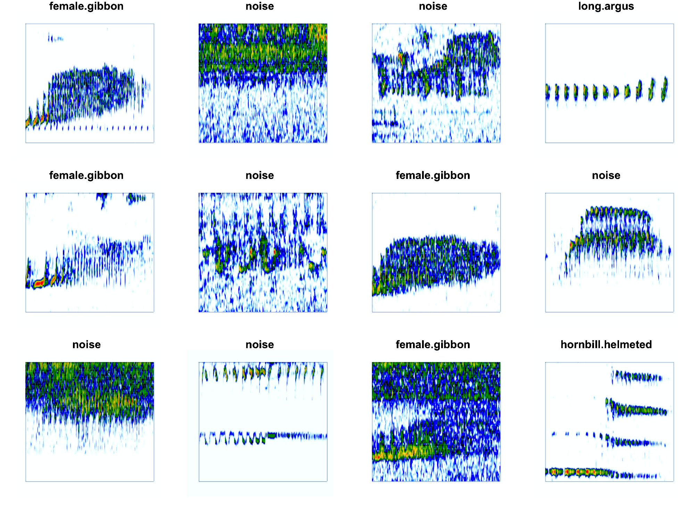

# Summary
Automated detection of acoustic signals is crucial for effective monitoring of vocal animals and their habitats across large spatial and temporal scales. Recent advances in deep learning have made high performance automated detection approaches more accessible to more practitioners. However, there are few deep learning approaches that can be implemented natively in R. The 'torch for R' ecosystem has made the use of transfer learning with convolutional neural networks accessible for R users. Here we provide an R package and workflow to use transfer learning for the automated detection of acoustics signals from passive acoustic monitoring (PAM) data collected in Sabah, Malaysia. The package provides functions to create spectogram images from PAM data, compare the performance of different pre-trained CNN architectures trained on the ImageNet dataset, deploy trained models over directories of sound files, and extract embeddings from trained models. The R programming language remains one of the most commonly used languages among ecologists, and we hope that this package makes deep learning approaches more accessible to this audience. In addition, these models can serve as important benchmarks for more state-of-the-art approaches. 

# Statement of need

## *Passive acoustic monitoring*

We are in a biodiversity crisis, and there is a great need for the ability to rapidly assess biodiversity in order to understand and mitigate anthropogenic impacts. One approach that can be especially effective for monitoring of vocal yet cryptic animals is the use of passive acoustic monitoring [@gibb2018], a technique that relies on autonomous acoustic recording units. PAM allows researchers to monitor vocal animals and their habitats, at temporal and spatial scales that are impossible to achieve using only human observers. Interest in use of PAM in terrestrial environments has increased substantially in recent years [@sugai2019], due to reduced price of the recording units and improved battery life and data storage capabilities. However, the use of PAM often leads to the collection of terabytes of data that is time- and cost-prohibitive to analyze manually.

## *Automated detection*

Some of the early non-deep learning approaches for the automated detection of acoustic signals in terrestrial PAM data include binary point matching [@katz2016], spectrogram cross-correlation [@balantic2020], or the use of a band- limited energy detector and subsequent classifier, such as support vector machine [@clink2023; @kalan2015]. Recent advances in deep learning have revolutionized image and speech recognition [@lecun2015 ], with important cross-over for the analysis of PAM data. Traditional approaches to machine learning relied heavily on feature engineering, as early machine learning algorithms required a reduced set of representative features, such as features estimated from the spectrogram. Deep learning does not require feature engineering [@stevens2020] . Convolutional neural networks (CNNs) --- one of the most widely used deep learning algorithms---are useful for processing data that have a 'grid-like topology', such as image data that can be considered a 2-dimensional grid of pixels [@goodfellow2016]. The 'convolutional' layer learns the feature representations of the inputs; these convolutional layers consist of a set of filters which are basically two-dimensional matrices of numbers and the primary parameter is the number of filters [@gu2018]. Therefore, with CNN's there is no feature engineering required. However, if training data are scarce, overfitting may occur as representations of images tend to be large with many variables [@lecun1995].

# *Transfer learning?*

Training deep learning models generally requires a large amount of training data and computing resources, which can be hard to obtain with PAM data. Transfer learning is an approach wherein the architecture of a pretrained CNN (which is generally trained on a very large dataset) is applied to a new classification problem. For example, CNNs trained on the ImageNet dataset of \> 1 million images [@deng2009] such as ResNet have been applied to automated detection/classification of primate and bird species from PAM data [@dufourq2022; @ruan2022]. At the most basic level, transfer learning in computer vision applications retains the feature extraction or embedding layers, and modifies the last few classification layers to be trained for a new classification task [@dufourq2022]. Recent advances have used embeddings from audio classification models trained on bird songs for new classification problems, and in most cases these embeddings led to better performance than general audio datasets [@ghani2023].

# State of the field

The two most popular open-source programming languages are R and Python [@scavetta2021]. Python has surpassed R in terms of overall popularity, but R remains an important language for the life sciences [@lawlor2022]. 'Keras' [@chollet2015], 'PyTorch' [@paszke2019] and 'Tensorflow' [@martínabadi2015] are some of the more popular neural network libraries; these libraries were all initially developed for the Python programming language. Until recently, deep learning implementations in R relied on the 'reticulate' package which served as an interface to Python [@ushey2022]. The transfer learning approaches included in this package have already been implemented in Python [@dufourq2022]. Previous implementations of automated detection using deep learning in R relied on the 'reticulate' package [@ruff2021 @silva2022soundclass]. However, the recent release of the 'torch for R' ecosystem provides a framework based on 'PyTorch' that runs natively in R and has no dependency on Python [@falbel2023]. Running natively in R means more straightforward installation, and higher accessibility for users of the R programming environment. @keydana2023 provides tutorials for transfer learning in the 'torch for R' ecosystem, and the functions in 'gibbonNetR' rely heavily on these tutorials.

# Usage

## Overview

This package provides functions to create spectrogram images, use transfer learning for six pretrained CNN architectures (AlexNet [@krizhevsky2017] , VGG16, VGG19 [@simonyan2014], ResNet18, ResNet50, and ResNet152 [@he2016]) trained on the ImageNet dataset [@deng2009 ]. The package also has functions to evaluate model performance, deploy the highest performing model over a directory of sound files, and extract embeddings from trained models to visualize acoustic data. We provide an example dataset that consists of labelled vocalizations of the loud calls of four vertebrates from Danum Valley Conservation Area, Sabah, Malaysia.

## Data summary

We include spectrogram images of five classes: great argus pheasant (*Argusianus argus*) long calls [@clink2021not], helmeted hornbills (*Rhinoplax vigil*), and rhinoceros hornbills (*Buceros rhinoceros*) [@kennedy2023evidence], female gibbons (*Hylobates funereus*) and a catch-all “noise” category. The data come from two separate PAM arrays in Danum Valley Conservation Area, Sabah, Malaysia. The training and validation data come from a wide array of Swift autonomous recording units placed on \~750 m spacing [@clink2023], and the test data come from a different, smaller array (\~250 m spacing) within the same area. We used a band-limited energy detector to identify signals that were 3-sec or longer duration within the 400-1600 Hz range, and then a single observer (DJC) manually sorted the detections into their respective categories [@clink2023].


## Spectrogram images

The package currently uses spectrogram images (Figure 1), and 'gibbonNetR' includes a function that can be used to create spectrogram images from .wav files. The 'splits' option will assign the specified proportion of clips to either training, validation, or test folders. We highly recommend that your test data come from a different recording time and/or location to better understand the generalizability of the models [@stowell2022].

```
 # Generate spectrogram images for training (70%) and validation (30%). 
 # Test data should come from a different source.
 spectrogram_images(
   trainingBasePath = trainingBasePath,
   outputBasePath = outputBasePath,
   minfreq.khz = 0.4,
   maxfreq.khz = 1.6,
   splits = c(0.7, 0.3, 0), 
   new.sampleratehz = 'NA'
 )
```



## Model training
The package currently allows for the training of six different CNN architectures ('alexnet', 'vgg16', 'vgg19', 'resnet18', 'resnet50', or 'resnet152'), and the user can specify whether or not to freeze the feature extraction layers. There is the option to train a binary or multi-class classifer.
```
# Location of spectrogram images for training
input.data.path <-  'data/examples/'

# Location of spectrogram images for testing
test.data.path <- 'data/examples/test/'

# User specified training data label for metadata
trainingfolder.short <- 'danummulticlassexample'

# We can specify the number of epochs to train here
epoch.iterations <- c(20)

# Function to train a multi-class CNN
gibbonNetR::train_CNN_multi(input.data.path=input.data.path,
                            architecture ='resnet18',
                            learning_rate = 0.001,
                            class_weights = rep( (1/5), 5),
                            test.data=test.data.path,
                            unfreeze.param = TRUE,
                            epoch.iterations=epoch.iterations,
                            save.model= TRUE,
                            early.stop = "yes",
                            output.base.path = "model_output/",
                            trainingfolder=trainingfolder.short,
                            noise.category = "noise")

```
## Evaluate model performance
We can compare the performance of different CNN architectures (Figure 2). Using the 'get_best_performance' function we can evaluate the performance of different model architectures on the test dataset for the specified class.
```
PerformanceOutput <- get_best_performance(performancetables.dir=performancetables.dir,
                                                      class='female.gibbon',
                                                      model.type = "multi",
                                                      Thresh.val=0)
PerformanceOutput$f1_plot
```


## Extract embeddings

Embeddings from deep learning models can be used as features in unsupervised approaches, with promising results for call repertoires [@10.1371/journal.pone.0283396] and individual identity [@lakdari2024mel]. This package contains the function 'extract_embeddings' to use pretrained CNNs to extract embeddings, where the trained model path, along with test data location and target class are specified.

```

result <- extract_embeddings(test_input="data/examples/test/",
                                      model_path=ModelPath,
                                     target_class = "female.gibbon")
```

## We can plot the unsupervised clustering results

In Figure 3 the top plot is a Uniform Manifold Approximation and Projection (UMAP) where each point represents one call, and the colors indicate the original class label. The bottom plot is the same UMAP plot, but with points colored based on cluster assignment by the 'hdbscan' algorithm [@dbscan].


### We can explore the unsupervised clustering results

Here we can see the Normalize Mutual Information score, which provides a value between 0 and 1, indicating the match between cluster labels and actual labels.

```
result$NMI
```

The confusion matrix is made using the 'caret' package[@kuhn2008] returns the results when we use 'hdbscan' [@dbscan] to match the target class to the cluster with the largest number of observations of that particular class.

```
result$ConfusionMatrix
```

# Future directions

There have been huge advances in the fields of deep learning and automated detection approaches for PAM data in recent years. The approach presented in this package (as of 2024) is no longer state of the art, although it was just recently developed. More recent approaches use transfer learning from models that are explicitly trained on bioacoustics data, such as BirdNET [@ghani2023]. However, there is a huge need in the field of bioacoustics to do benchmarking, wherein different model architectures and performance are compared across diverse datasets. Therefore, the methods presented here can provide important benchmarks for future work, and for understanding how and if advances improve performance over more traditional methods. The R package is available on [Github](https://github.com/DenaJGibbon/gibbonNetR), where issues can be opened.

# Acknowledgments

We would like to thank the Sabah Biodiversity Centre and Danum Valley Conservation Area for granting us permission to conduct research.

# References


