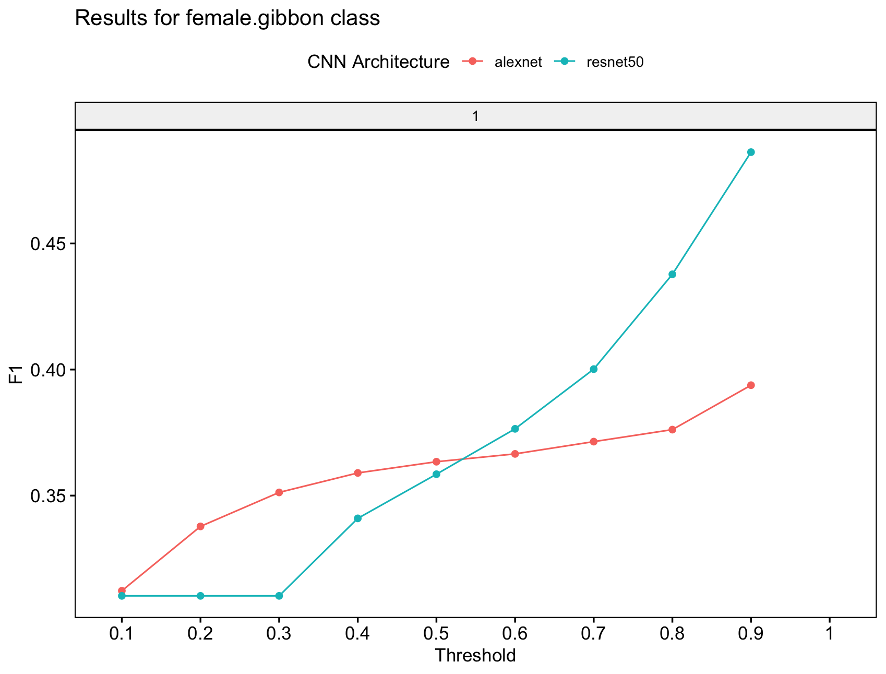
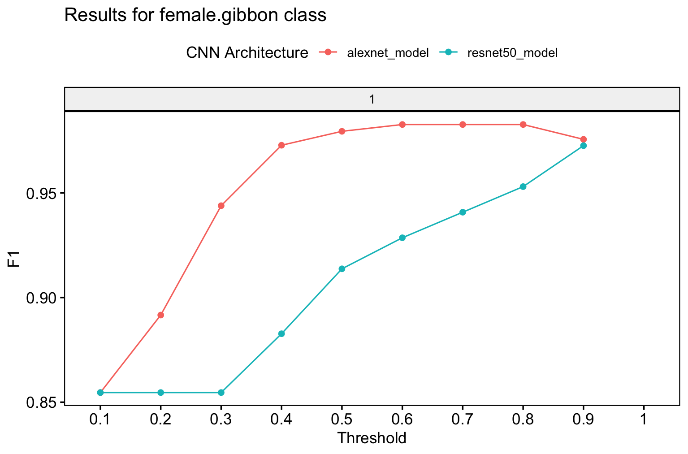

```{r, eval = TRUE, echo = FALSE, message=FALSE}
# global option chunks
knitr::opts_chunk$set(
  fig.width = 5, 
  fig.height = 3.5,
  dpi = 70,
  comment = "",
  out.width = "80%",
  fig.align = "center",
  message = TRUE,
  warning = TRUE
)

options(width = 100, max.print = 100)
```

# Data Preparation

## First load the package
```{r message=FALSE}
library(gibbonNetR)
```

## We create spectrogram images of the sound files. 
To follow best practices we want to use training and test data from different passive acoustic monitoring arrays These clips are from Danum Valley Conservation Area, Sabah, Malaysia, but are taken from two different arrays. The "spectrogram_images" function takes folders organized and labeled by signal type, and creates training, validation, or test folders using the "splits" specified in the function call. In the example below 70% of the data is used for training and 30% for validation.   

```{r eval=FALSE}
# Link to training clips on Zenodo
ZenodoLink <- 'https://zenodo.org/records/14212086/files/trainingclips.zip?download=1'

# Download into specified zip file location
download.file(url = ZenodoLink, destfile = 'data/trainingclips.zip',method='curl')

# Unzip folder
exdir <- 'data/'
utils::unzip(zipfile = 'data/trainingclips.zip', exdir = exdir )

# Check folder composition
TrainingDatapath <- paste(exdir,"trainingclips",sep='')

# Check folder names
list.files(TrainingDatapath)

# Create spectrogram images
spectrogram_images(
   trainingBasePath = TrainingDatapath,
   outputBasePath = 'data/trainingimages/',
   minfreq.khz = 0.4,
   maxfreq.khz = 1.6,
   random=FALSE,
   splits = c(0.7, 0.3, 0), # Assign proportion to training, validation, or test folders
   new.sampleratehz = 'NA'
 )


```

```{r, echo=FALSE, out.width="50%", fig.cap="A sample of the spectrogram images."}
knitr::include_graphics("spectro.png")
```

## Download example test files on Zenodo and convert to spectrogram images
The "spectrogram_images" function below puts 100% of the test images into the test folder. 
```{r eval = FALSE}
library(gibbonNetR)

# Link to training clips on Zenodo
ZenodoLink <- 'https://zenodo.org/records/14212086/files/testclips.zip?download=1'

# Download into specified zip file location
download.file(url = ZenodoLink, destfile = 'data/testclips.zip',method='curl')

# Unzip folder
exdir <- 'data/'
utils::unzip(zipfile = 'data/testclips.zip', exdir = exdir )

# Check folder composition
TestDatapath <- paste(exdir,"testclips",sep='')

# Check folder names
list.files(TestDatapath)

# Create spectorgram images
spectrogram_images(
   trainingBasePath = TestDatapath,
   outputBasePath = 'data/testimages/',
   minfreq.khz = 0.4,
   maxfreq.khz = 1.6,
   splits = c(0, 0, 1), # Assign proportion to training, validation, or test folders
   new.sampleratehz = 'NA'
 )

```

# Model training
We start with a multi-class model. We will use the spectrogram images for training, test and validation that we created above. Note that for "input.data.path" the train and valid folders need to be there. For the test data, the path must contain the 'test' folder. You can specify multiple model architectures and number of epochs for training.  

```{r eval = FALSE}
# Location of spectrogram images for training
input.data.path <-  'data/trainingimages/'

# Location of spectrogram images for testing
test.data.path <- 'data/testimages/test/'

# User specified training data label for metadata
trainingfolder.short <- 'danummulticlassexample'

# Specify the architecture type
architecture <- c('alexnet','resnet50') # Choose 'alexnet', 'vgg16', 'vgg19', 'resnet18', 'resnet50', or 'resnet152'

# We can specify the number of epochs to train here
epoch.iterations <- c(1)

# Function to train a multi-class CNN
gibbonNetR::train_CNN_multi(input.data.path=input.data.path,
                            architecture =architecture,
                            learning_rate = 0.001,
                            class_weights = c(0.3, 0.3, 0.2, 0.2, 0),
                            test.data=test.data.path,
                            unfreeze.param = TRUE,
                            epoch.iterations=epoch.iterations,
                            save.model= TRUE,
                            early.stop = "yes",
                            output.base.path = "data/model_output/",
                            trainingfolder=trainingfolder.short,
                            noise.category = "noise")
```

# Model evaluation 
## Specify for the 'female.gibbon' class

```{r eval = FALSE}
# Evaluate model performance
performancetables.dir <- "data/model_output/_danummulticlassexample_multi_unfrozen_TRUE_/performance_tables_multi"

PerformanceOutput <- gibbonNetR::get_best_performance(performancetables.dir=performancetables.dir,
                                                      class='female.gibbon',
                                                      model.type = "multi",Thresh.val=0)

```

```{r,eval=FALSE}
# Evaluate model performance
performancetables.dir <- "/Users/denaclink/Desktop/RStudioProjects/gibbonNetR/data/model_output/_danummulticlassexample_multi_unfrozen_TRUE_/performance_tables_multi"

PerformanceOutput <- gibbonNetR::get_best_performance(performancetables.dir=performancetables.dir,
                                                      class='female.gibbon',
                                                      model.type = "multi",Thresh.val=0)

```


## Examine the results
Note that we would not expect great performance since we only trained for one epoch.
```{r, eval=FALSE}
PerformanceOutput$f1_plot

PerformanceOutput$best_f1$F1
[1] 0.4862252

PerformanceOutput$best_auc$AUC
[1] 0.2858019

PerformanceOutput$best_precision$Precision
[1] 0.321817

PerformanceOutput$best_recall$Recall
[1] 1
```

```{r, echo=FALSE, out.width="50%", fig.cap="Output from 'get_best_performance' fuction ."}

```

# Trained model evaluation
We can deploy the trained model over another test dataset to see how well it performs. In this case, the test data is organized into folders with corresponding labels that match those from the training data.  

```{r, eval=FALSE}
Modify the script above to download the apppropriate test files
ZenodoLink <- 'https://zenodo.org/records/14212086/files/testclipsmaliau.zip?download=1'
```

We want to create spectrogram images for this new test dataset. The sample rate for the original files was higher (48 kHz) so we use the downsample call in the function to make sure the spectrogram images are the same resolution.
```{r, eval=FALSE}
TestDatapath <- 'data/testclipsmaliau'

# Create spectorgram images
spectrogram_images(
   trainingBasePath = TestDatapath,
   outputBasePath = 'data/testimagesmaliau/',
   minfreq.khz = 0.4,
   maxfreq.khz = 1.6,
   splits = c(0, 0, 1), # Assign proportion to training, validation, or test folders
   new.sampleratehz = 16000
 )
```


The 'evaluate_trainedmodel_performance_multi' function will compare the model performance of pretrained models on another test dataset. 
```{r, eval=FALSE}

trained_models_dir <- '/Users/denaclink/Desktop/RStudioProjects/gibbonNetR/data/model_output/_danummulticlassexample_multi_unfrozen_TRUE_/'

class_names <- dput(list.files('/Users/denaclink/Desktop/RStudioProjects/gibbonNetR/data/trainingimages/train/'))

image_data_dir <- 'data/testimagesmaliau/test/'

dir.create('/data/model_output_test/',recursive = T)

evaluate_trainedmodel_performance_multi(trained_models_dir=trained_models_dir,
                                          class_names=class_names,
                                          image_data_dir=image_data_dir,
                                           output_dir= 'data/model_output_test/',
                                           noise.category = "noise")

```

Now we can use the same function as above 'get_best_performance' to investigate model performance.
```{r,eval=FALSE}
# Evaluate model performance
performancetables.dir <- "data/model_output_test/performance_tables_multi_trained/"

PerformanceOutput <- gibbonNetR::get_best_performance(performancetables.dir=performancetables.dir,
                                                      class='female.gibbon',
                                                      model.type = "multi",Thresh.val=0)

```

We see that there is a high F1 score across thresholds for the 'female.gibbon' class
```{r, echo=FALSE, out.width="50%", fig.cap="Output from 'get_best_performance' fuction ."}

```

