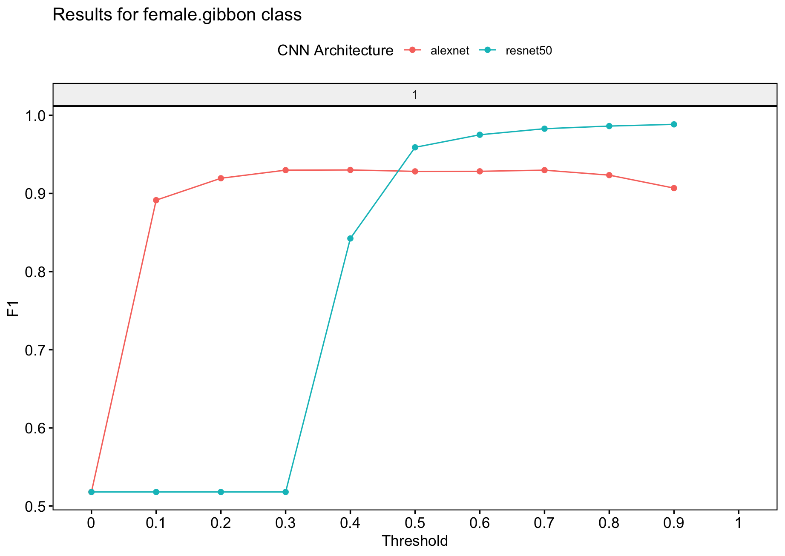

```{r, eval = TRUE, echo = FALSE, message=FALSE}
# global option chunks
knitr::opts_chunk$set(
  fig.width = 5, 
  fig.height = 3.5,
  dpi = 70,
  comment = "",
  out.width = "80%",
  fig.align = "center",
  message = TRUE,
  warning = TRUE
)

options(width = 100, max.print = 100)
```

# Binary model training
We will now train a binary model. We will use the spectrogram images for training, test and validation that we created previously Note that for "input.data.path" the train and valid folders need to be there. For the test data, the path must contain the 'test' folder. You can specify multiple model architectures and number of epochs for training.  

```{r eval = FALSE}
# Location of spectrogram images for training
input.data.path <-  'data/trainingimagesbinary/'

# Location of spectrogram images for testing
test.data.path <- 'data/testimagesbinary/test/'

# User specified training data label for metadata
trainingfolder.short <- 'danummbinaryexample'

# Specify the architecture type
architectures <- c('alexnet','resnet50') # Choose 'alexnet', 'vgg16', 'vgg19', 'resnet18', 'resnet50', or 'resnet152'

# We can specify the number of epochs to train here
epoch.iterations <- c(1)

# Function to train a multi-class CNN
gibbonNetR::train_CNN_binary(
      input.data.path = input.data.path,
      noise.weight = 0.25,
      architecture = architectures,
      save.model = FALSE,
      learning_rate = 0.001,
      test.data = test.data.path,
      batch_size = 32,
      unfreeze.param = TRUE,
      # FALSE means the features are frozen
      epoch.iterations = epoch.iterations,
      list.thresholds = seq(0, 1, .1),
      early.stop = "yes",
      output.base.path = 'data/model_output_binary/',
      trainingfolder = trainingfolder.short,
      positive.class = "female.gibbon",
      negative.class = "noise"
    )

```

# Model evaluation 
## Specify for the 'female.gibbon' class

```{r eval = FALSE}
# Evaluate model performance
performancetables.dir <- "data/model_output_binary/_danummbinaryexample_binary_unfrozen_TRUE_/performance_tables"

PerformanceOutput <- gibbonNetR::get_best_performance(performancetables.dir=performancetables.dir,
                                                      class='female.gibbon',
                                                      model.type = "binary",Thresh.val=0)

```


## Examine the results
Here we get decent performance forr the threshold dependent metrics, AUC is still not great.
```{r, eval=FALSE}
PerformanceOutput$f1_plot

PerformanceOutput$best_recall$Recall
[1] 1

PerformanceOutput$best_f1$F1
[1] 0.9884259

PerformanceOutput$best_auc$AUC
[1] 0.4363169

PerformanceOutput$best_precision$Precision
[1] 0.9907193

PerformanceOutput$best_recall$Recall
[1] 1

```

 
  <figcaption>"Output from 'get_best_performance' fuction"</em>

