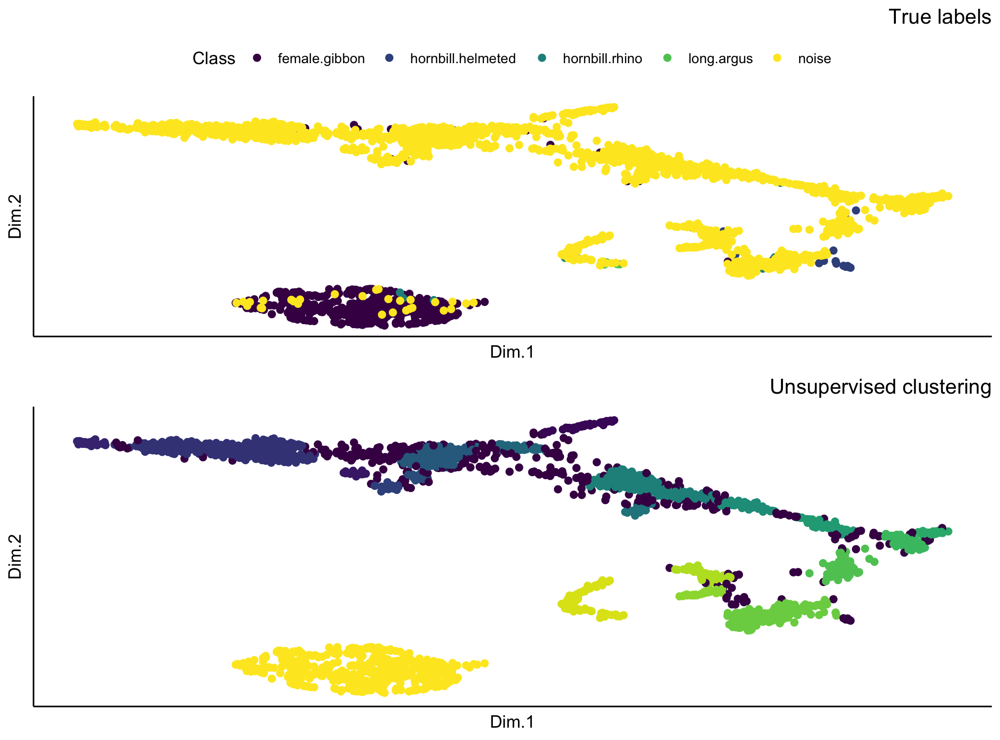

# Extract embeddings
Embeddings are learned feature representations from CNNs. Instead of doing classification, the CNNs can also be used as feature extractors for spectrogram images. 

Use the pre-trained model to extract embeddings and use unsupervised clustering to identify signals

```{r, eval=F, warning=FALSE, results='hide'}
ModelPath <- "data/model_output/_danummulticlassexample_multi_unfrozen_TRUE_/_danummulticlassexample_1_alexnet_model.pt"

result <- extract_embeddings(
  test_input = "data/testimages/test/",
  model_path = ModelPath,
  target_class = "female.gibbon"
)
```

## We can plot the unsupervised clustering results

```{r, eval=F}
result$EmbeddingsCombined
```

 
  <figcaption>"Unsupervised clustering with embeddings"<figcaption>


### We can explore the unsupervised clustering results

Here we can see the Normalize Mutual Information score

```{r, eval=F}
result$NMI
```

The confusion matrix results when we use 'hdbscan' to match the target class to the cluster with the largest number of observations

```{r, eval=F}
result$ConfusionMatrix
```

